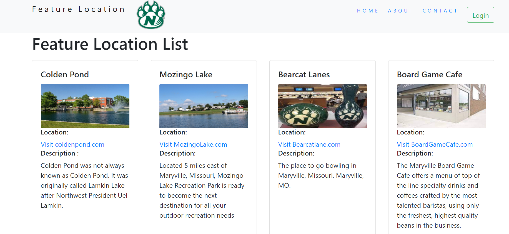

## Proposal for Feature Location

### Schedule & Sprints
- set by the GDP semesters (about every 2-weeks = a sprint). Each process is scheduled to be completed in 1 Sprint.
## Process & Schedule

#### Sprint 1.  Requirement Gathering (Sep 24th 2021 - Sep 31st 2021)
- We need to figure out what you need and what you believe in. Then we can start creating the application that can conveys the needs you provide in way that is meaningful to your app users. It help us to understand and to design sketches.

#### Sprint 2. Design presentation(Oct 2nd 2021 - Oct 14th 2021)
- We design a new home page which contains the information about the particular location using front-end html, CSS and bootstrap. There will undoubtedly be a common subject, but we attempt to think and   come up with something unique. We will be going through the  design and decide which route to go in as well as any changes that need to be done.

#### Sprint 3. Build website(Oct 18th 2021- Oct 30th 2021)
- The Backend is created with Node.js and Express Framework, based on all we've learned. A page will be created where users can add new destinations. We'll give it to you after it's finished and go over the details in accordance with the goals, we set out to achieve. Any changes are done at this stage.

#### Sprint 4. Testing and release(Nov 2nd 2021 - N0v 12th 2021)
- The functionalities that have been developed thus far have been tested, and the application is now hosted on Heroku and will run on any device. The deployment link will be supplied to you so that you may test the application. Any deployment concerns will be addressed, and the application will be ready for continued development next semester.

#### Sprint 5. Authentication and Authorization (Jan 20 2022 - Jan 27th 2022)
* In this sprint the user can able to login with registered mail address or with third party authorization such as facebook or gmail. New users can sign up with the email address where same credentials can be used for logging into the App.

#### Sprint 6. Location updates (Jan 29 2022 – Feb 13 2022)
* The users will have previlage to perform  update , add and delete locations . Where location of the photo can be uploaded and the location details can be updated . They all will be stored int the database .

#### Sprint 7. Forgot Password (Feb 14 2022 - Feb 28 2022)
*	Improving the user access with the forget password which will send the token to recet the password  then, the user can reloging with the new password .

#### Sprint 8. User Testing (Feb 29 2022 - Mar 12 2022)
* All the funtionalities and the UI will be tested in this sprint that includes the webpage responsiveness,button functionalities and image view .

#### Sprint 9. Final Presentation (Mar 14 2022 - Mar 21 2022)
*	The full version of the Application will be presented to the Client. If any changes or suggestions from the client will be implemented and deployed .

## Budget

| S. No. | Name                                                            | Role              | Hourly Pay                | Hours/ Week | Estimated Cost/ Week |
|------|--------------------------------------------------------------------|--------------------|------------------------| ------------- | ---------- |
| 1    | [Abhilash Ramavaram](https://github.com/AbhiRam0099)           | Back-end Developer  | $60 |   9 - 12 |  $540 - $720 |
| 2    | [Madhari,Narsing Rao Nikitha](https://github.com/NikithaMN-05)                   | Front-end Developer | $50 | 9 - 12 | $450 - $600 |

### Scope of work
- clearly divided into sprint buckets of time.

### Technology Stack
- Backend language + framework:Node and Express
- Host:Heroku
- Data host + type:Heroku MongoDB
- Front-end page plan:server-side views or ejs
- Front-end responsive design:Bootstrap 

### Team members
- Abhilash Ramavaram
- Madhari,Narsing Rao Nikitha

### Application Screenshots 

### *** To Accept , Sign Below***

   -------------------------
  Accepted by Rasagna Reddy
